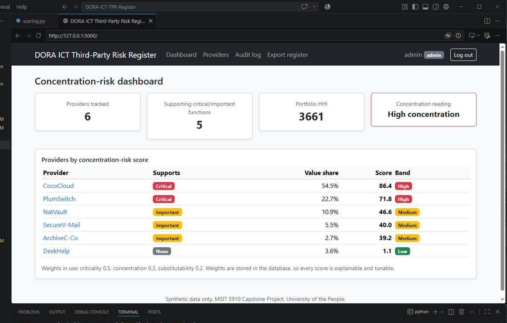
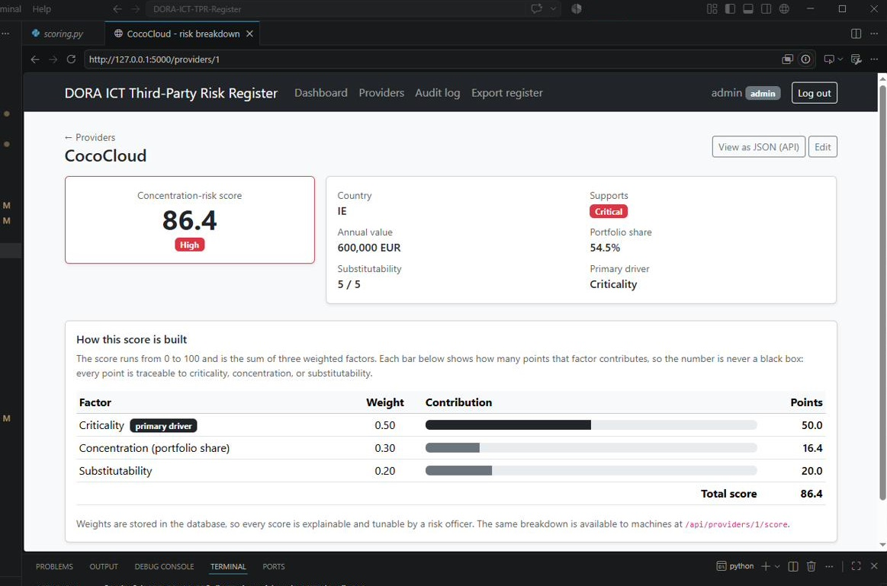
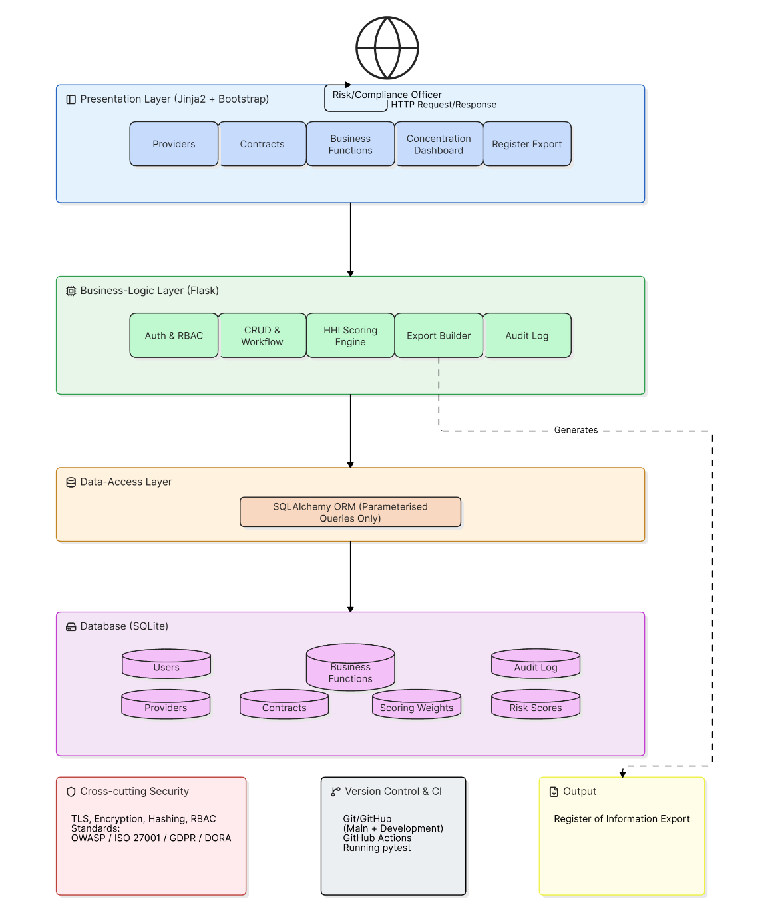

# DORA ICT Third-Party Risk Register and Concentration-Risk Tool


A lightweight web application that helps a financial entity inventory its information and communication technology (ICT) third-party providers, score **concentration risk** transparently, and export a supervisory **Register of Information** under the EU **Digital Operational Resilience Act (DORA)**.

> Capstone project for MSIT 5910, University of the People. All data is synthetic.

---

## The problem

Since January 2025, DORA requires every in-scope financial entity to keep an accurate register of its ICT third-party arrangements and to actively manage the risk of depending too heavily on a single provider for critical services. Many firms still do this in fragmented spreadsheets: a 2024 supervisory dry run found that most participating entities could not produce a clean register from the tools they had. This project turns that obligation into a usable, auditable instrument.

## What it does

- **Inventories** providers, contracts, and business functions, flagging those that support critical or important functions.
- **Scores concentration risk** for each provider from three inputs, criticality, portfolio share (via the Herfindahl-Hirschman Index), and substitutability, combined through transparent, database-stored weights.
- **Explains every score** factor by factor, so the number is never a black box.
- **Exports** a Register of Information as CSV in the supervisory shape.
- **Controls access** with three roles (administrator, editor, viewer) and records every change and export in an append-only audit log.

## Screenshots

**Concentration-risk dashboard**



**Provider detail with score breakdown**



## Architecture

A layered (n-tier) design keeps the presentation, business-logic, data-access, and database layers cleanly separated, so a change in one layer does not ripple through the others.



## Tech stack

Python, Flask, SQLAlchemy, SQLite, Jinja2, and Bootstrap. Tested with pytest, with continuous integration through GitHub Actions.

## Run it locally

```bash
git clone https://github.com/VC-dot-com/DORA-ICT-TPR-Register.git
cd DORA-ICT-TPR-Register
python -m venv venv
venv\Scripts\activate            # Windows  (use: source venv/bin/activate  on macOS/Linux)
pip install -r requirements.txt
python seed.py                   # load the synthetic register
python run.py                    # then open http://127.0.0.1:5000
```

Demo accounts (synthetic): `admin` / `admin123`, `editor` / `editor123`, `viewer` / `viewer123`.

## Testing

```bash
pytest -q
```

38 automated tests: 18 unit tests on the scoring engine and 20 integration tests spanning authentication, role-based access, provider CRUD, the dashboard, the score API, the audit log, and the register export. The same suite runs on every push through GitHub Actions.

## Concentration-risk methodology

Each provider's score (0 to 100) is a weighted blend of criticality (0.50), concentration (0.30), and substitutability (0.20). Portfolio concentration is measured with the Herfindahl-Hirschman Index and banded Low, Moderate, or High using thresholds drawn from competition policy. The weights live in the database, so a risk officer can inspect and tune them, and every result stays explainable and auditable.

## Versioning

Semantic versioning, derived from Git tags:

| Version | Milestone |
| --- | --- |
| v0.1.0 | First working implementation |
| v0.2.0 | Scoring correctness and explainability |
| v0.3.0 | Evaluation, performance, and API enhancements |
| v0.4.0 | Integration testing and system validation |
| v1.0.0 | Final capstone release |

The running application shows its version and build in the page footer.

## Documentation

The full capstone report, covering the design, methodology, results, and discussion, is included in the repository.

## License and disclaimer

This is an academic prototype built entirely on synthetic data. It is a demonstration of a concentration-risk methodology, not a production compliance system.
